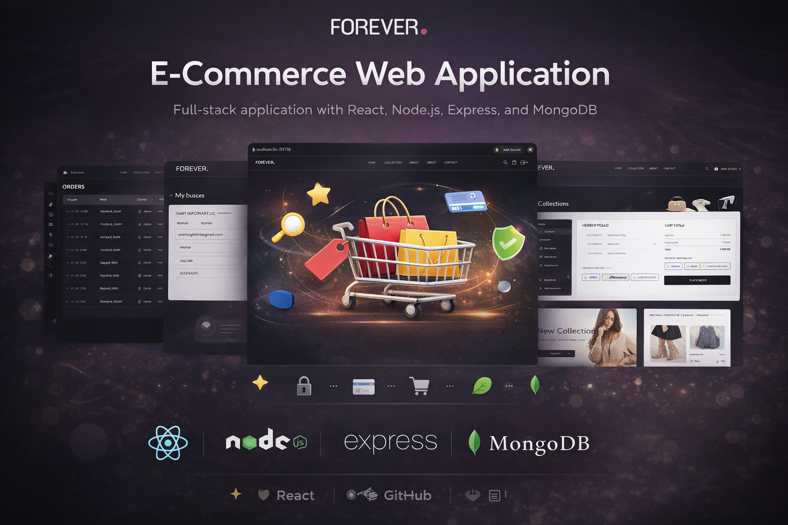
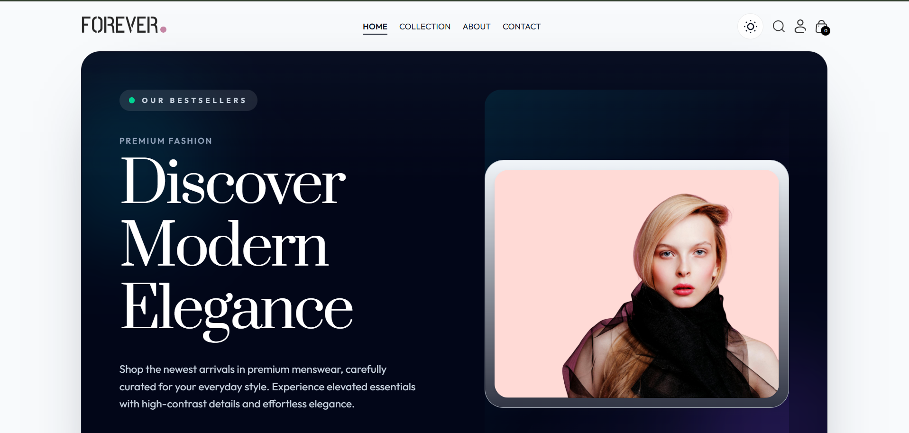
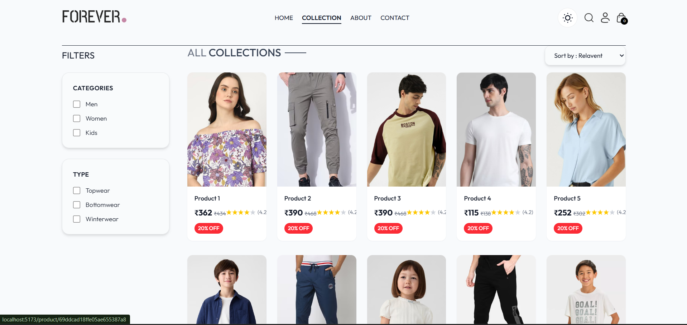
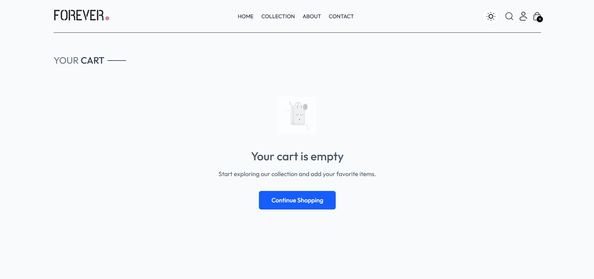
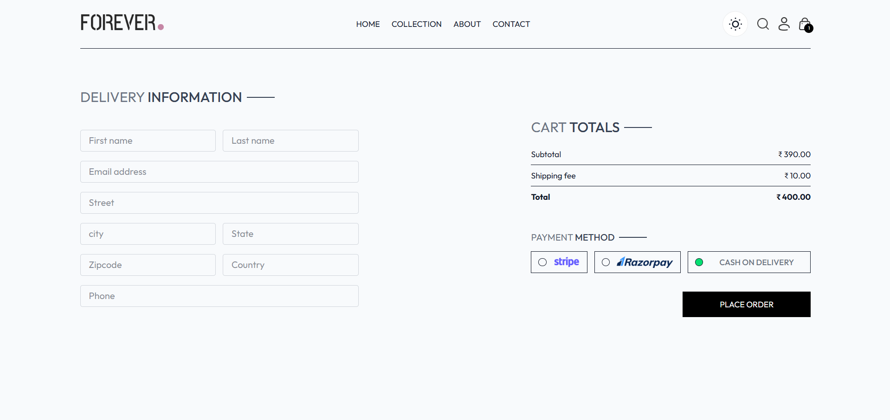
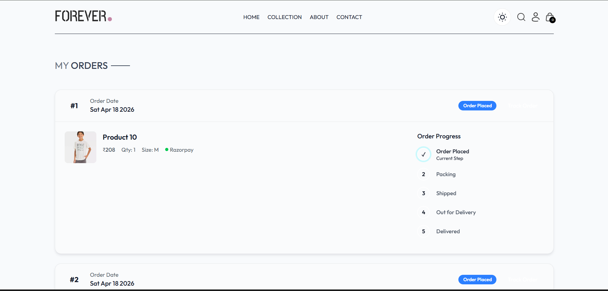
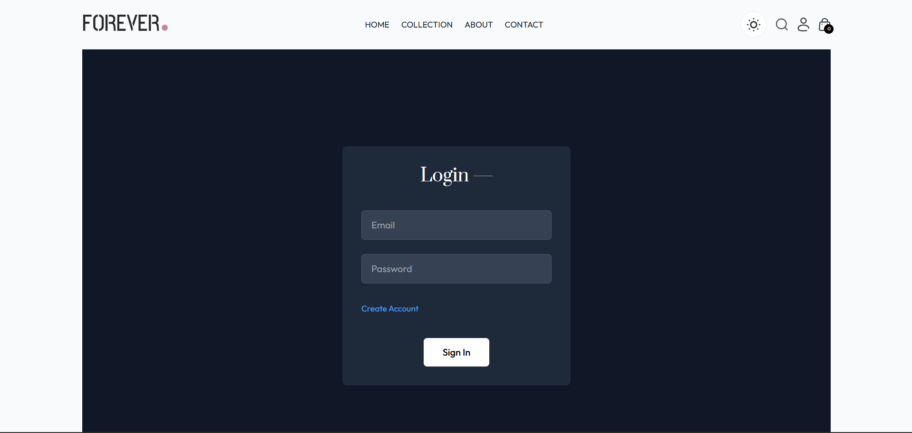

# 🛒 E-Commerce Web Application



A full-stack e-commerce web application that allows users to browse products, manage their cart, and place orders with secure authentication and integrated payment options. The project features a modern dark-themed UI and a smooth, responsive user experience.

---

## ✨ Features

* 🔐 User Authentication (Login / Signup / Logout)
* 🛍️ Product Browsing & Collections
* 🔎 Search and Filter Products
* 🛒 Cart Management (works before login)
* 🔒 Protected Checkout (login required)
* 💳 Payment Integration (COD, Razorpay, Stripe)
* 📦 Orders Page (track placed orders)
* 🌙 Dark Mode UI
* 📱 Fully Responsive Design

---

## 📸 Screenshots

### 🏠 Home Page



### 🛍️ Collection Page



### 🛒 Cart Page



### 💳 Checkout Page



### 📦 Orders Page



### 🔐 Login Page



---

## 🛠️ Tech Stack

### Frontend

* React (Vite)
* Tailwind CSS (Dark UI)
* React Router
* Axios

### Backend

* Node.js
* Express.js
* MongoDB (Mongoose)
* JWT Authentication

### Tools

* Git & GitHub
* GitHub Copilot (used for UI enhancements)

---

## 📁 Project Structure

```
E_commerce_App/
├── frontend/
│   ├── src/
│   │   ├── components/      # UI components
│   │   ├── pages/           # Pages (Home, Cart, Orders, etc.)
│   │   ├── context/         # Global state (ShopContext)
│   │   ├── hooks/           # Custom hooks
│   │   └── App.jsx
│   └── package.json
│
├── Backend/
│   ├── controllers/         # Business logic
│   ├── models/              # MongoDB schemas
│   ├── routes/              # API routes
│   ├── middleware/          # Authentication & utilities
│   └── server.js
│
├── admin/                   # Admin panel (optional)
│   ├── src/
│   └── package.json
```

---

## ⚙️ Installation & Setup

### 1. Clone Repository

```bash
git clone https://github.com/ankit-2678/ecommerce-app.git
cd ecommerce-app
```

### 2. Backend Setup

```bash
cd Backend
npm install
```

Create a `.env` file:

```
MONGODB_URI=your_mongodb_url
JWT_SECRET=your_secret_key
STRIPE_SECRET_KEY=your_key
RAZORPAY_KEY_ID=your_key
```

Run backend:

```bash
npm run server
```

### 3. Frontend Setup

```bash
cd frontend
npm install
npm run dev
```

---

## 🚀 Usage

* Open: http://localhost:5173
* Browse products
* Add items to cart
* Login to proceed to checkout
* Place orders

---

## 🔐 Authentication Flow

* Users can add items to cart without login
* Checkout is restricted to authenticated users
* Unauthorized access is blocked at both frontend and backend

---

## 🎯 Key Highlights

* Clean and modern dark-themed UI
* Real-world e-commerce workflow
* Secure JWT-based authentication
* Well-structured full-stack architecture

---

## 🚀 Future Improvements

* Wishlist functionality
* Product reviews and ratings
* Improved animations and UI transitions
* Deployment (Vercel / Render)
* Performance optimization

---

## 👨‍💻 Author

**Ankit Kumar**
GitHub: https://github.com/ankit-2678

---

## ⭐ Note

This project was built to practice full-stack development, including UI design, authentication, and real-world application workflows.

If you found this project helpful, consider giving it a ⭐ on GitHub!
